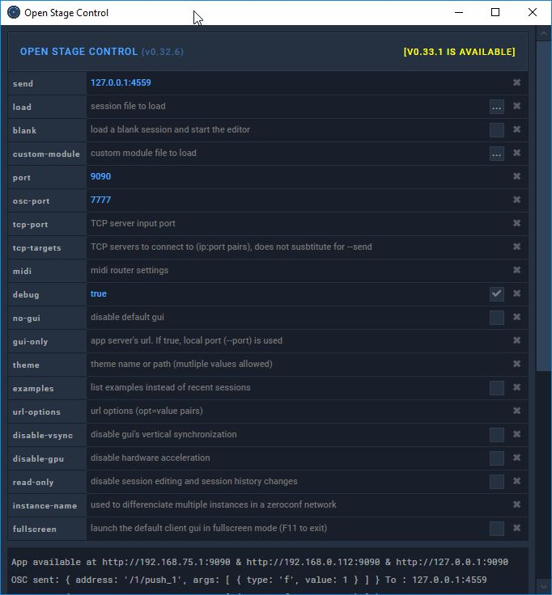
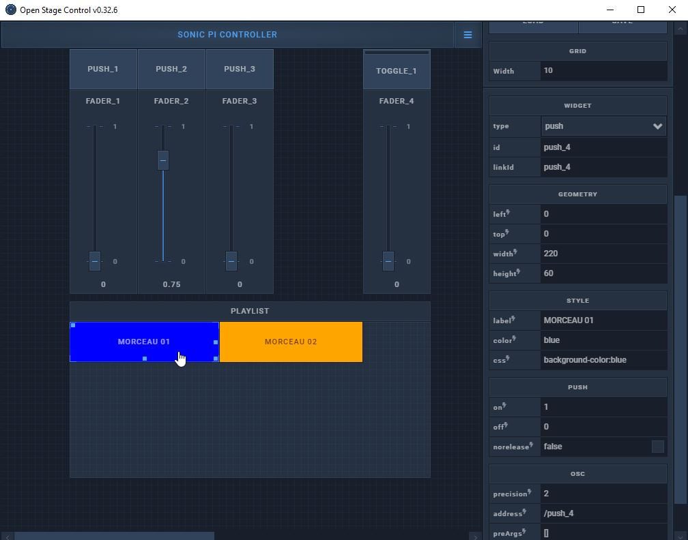

# Communiquer avec Open Stage Control

***Open stage control*** permet de modifier dynamiquement son interface avec des messages osc appropriés.

La documentation nous en dit un peu plus. https://osc.ammd.net/extras/remote-control/

## Exemple de script pour agir sur l'interface web dynamiquement

```python
"""
Test d'envoi vers open stage control d'un message osc
pour changer un label dynamiquement
"""
import argparse
import random
import time

import json

from pythonosc import osc_message_builder
from pythonosc import udp_client


"""
jsonData = '{"label":"New Label"}'
jsonToPython = json.loads(jsonData)
"""

pythonDictionary = {'label':'nouveau nom',
'css':'background-color:blue'}
dictionaryToJson = json.dumps(pythonDictionary)

if __name__ == "__main__":
  parser = argparse.ArgumentParser()
  parser.add_argument("--ip", default="127.0.0.1",
      help="adresse ip du serveur openstagecontrol")
  parser.add_argument("--port", type=int, default=7777,
      help="7777 the port open stage Control is listening on")
  args = parser.parse_args()

  client = udp_client.SimpleUDPClient(args.ip, args.port)
print(dictionaryToJson)
client.send_message("/fader_1", 0.25)
time.sleep(2)
client.send_message("/fader_2", 0.75)
time.sleep(2)
client.send_message("/push_5/display", 0)
time.sleep(2)
client.send_message("/push_5/display", 1)
time.sleep(2)
client.send_message("/EDIT", ("push_4", dictionaryToJson))
time.sleep(16)
client.send_message("/EDIT", ("push_4", '{"label":"Modified from script python", "color":"blue"}'))
```

### Interface à charger dans Open Sound Control

1. lancer OpenStageControl

2. Voici ce que vous devriez voir.



3. charger l'interface en cliquant sur les ... de la ligne Load. Pointez vers le fichier json contenant l'interface d'Open Stage Control. 

4. appuyer sur Start.

5. Dans un navigateur http://127.0.0.1:9090

Ce qui nous donne comme interface ceci que vous pouvez atteindre à l'adresse http://127.0.0.1:9000


